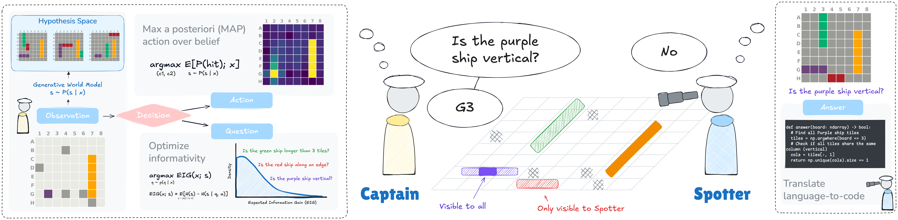

# Shoot First, Ask Questions Later: Building Rational Agents That Explore and Act Like People

[](https://arxiv.org/abs/2510.20886)
[](https://opensource.org/licenses/MIT)
[](https://www.python.org/downloads/release/python-3100/)

This is the official code repository for the paper [Shoot First, Ask Questions Later: Building Rational Agents That Explore and Act Like People](https://arxiv.org/abs/2510.20886) by Gabriel Grand, Valerio Pepe, Joshua B. Tenenbaum, and Jacob Andreas.



## Getting Started

```
git clone git@github.com:gabegrand/battleship.git
```

### With Poetry (Recommended)

This codebase uses [Poetry](https://python-poetry.org/) to manage dependencies. If you don't have Poetry installed, you can do so by following the instructions [here](https://python-poetry.org/docs/#installation).

```bash
cd battleship
poetry install
```

> [!NOTE]
> If you also want to install optional development dependencies (e.g., for running unit tests, code formatting, and plotting), you can do so with:

```bash
poetry install --with dev
```

Once the installation is complete, you can [activate the virtual environment](https://python-poetry.org/docs/managing-environments/#activating-the-environment):

```bash
# Default with Poetry v2.0
eval $(poetry env activate)

# Alternative with Poetry v1.x or with the poetry-shell plugin
poetry shell
```

## With pip

For convenience, we also provide a [build-system] section in `pyproject.toml`, so you can install the package with pip. We recommend using a virtual environment (e.g., via `venv` or `conda`) to avoid dependency conflicts.

```bash
cd battleship
pip install -e .
```

# Running Experiments

We're currently working on providing detailed documentation for running experiments. In the meantime, here are some example commands to get you started.

## Spotter Experiments

```bash
# Start new experiment
python run_spotter_benchmarks.py --llms gpt-4o-mini --spotter-models CodeSpotterModel

# Resume interrupted experiment
python run_spotter_benchmarks.py --resume --experiment-dir {EXPERIMENT_DIR}

# Force restart (clear existing results)
python run_spotter_benchmarks.py --force-restart --experiment-dir {EXPERIMENT_DIR}

# Resume with additional configurations
python run_spotter_benchmarks.py --resume --experiment-dir {EXPERIMENT_DIR} --llms gpt-4o gpt-4o-mini
```

## Captain Experiments

```bash
# Start new captain experiment
python run_captain_benchmarks.py --captains LLMDecisionCaptain --captain-llm gpt-4o-mini --spotter-llm gpt-4o-mini

# Resume interrupted captain experiment
python run_captain_benchmarks.py --resume --experiment-dir {EXPERIMENT_DIR}

# Force restart captain experiment (clear existing results)
python run_captain_benchmarks.py --force-restart --experiment-dir {EXPERIMENT_DIR}

# Resume with additional configurations
python run_captain_benchmarks.py --resume --experiment-dir {EXPERIMENT_DIR} --captains LLMDecisionCaptain RandomCaptain --seeds 42 123
```

# Dataset

The BattleshipQA dataset can be found in `data/human-dataset.csv`. This file contains a compiled summary of all 126 human games.

The raw data, including individual message logs, can be found in `experiments/collaborative/data/battleship-final-data/`. The various files `game.csv`, `round.csv`, `stage.csv` store structured information about player interactions at various levels of granularity. More information about this data format can be found in the [Empirica v2 docs](https://docs.empirica.ly/guides/managing-the-data).

The data for the 18 randomly-generated board contexts used in the experiments can be found in `experiments/collaborative/contexts/board_BXX.txt`, where `BXX` is the board ID.

# Citations

If you use this code or data in your research, please cite our paper:

```bibtex
@article{grand2025battleship,
  title={Shoot First, Ask Questions Later? Building Rational Agents That Explore and Act Like People},
  author={Gabriel Grand and Valerio Pepe and Joshua B. Tenenbaum and Jacob Andreas},
  journal={ArXiv},
  year={2025},
  volume={abs/2510.20886},
  url={https://arxiv.org/abs/2510.20886}
}
```